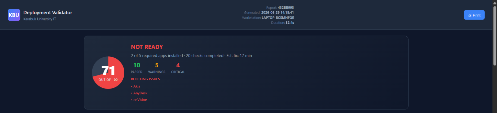
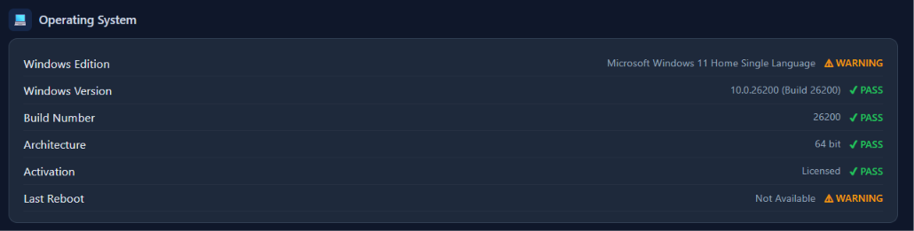
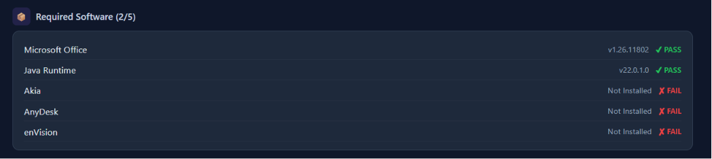
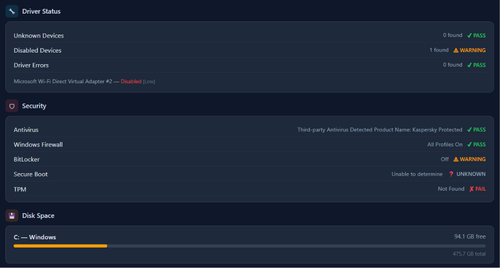
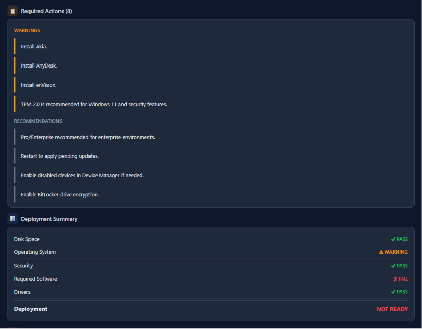

<p align="center">
  
  
  
  
  
</p>

<h1 align="center">KBU Deployment Validator</h1>

<p align="center">
  <strong>Enterprise Windows Workstation Deployment Readiness Validation</strong><br>
  Answers one question: <em>Can this workstation be deployed to the end user?</em>
</p>

---

## Overview

KBU Deployment Validator is a read-only PowerShell tool that validates whether a Windows workstation is ready for deployment after OS installation, software provisioning, and configuration. It performs targeted checks across 5 modules, calculates a weighted deployment score (0–100), and generates a professional dark-themed HTML dashboard.

**This tool does NOT modify, install, delete, or configure anything on the system.**

---

## Features

<table>
<tr>
  <td width="50%">

### Core Validation
- **Operating System** — Edition, version, build, architecture, activation, uptime
- **Required Software** — Office, Java, Akia, AnyDesk, enVision
- **Driver Diagnostics** — Unknown devices, disabled devices, error codes with severity classification
- **Security** — Antivirus (Defender + third-party), Firewall, BitLocker, Secure Boot, TPM
- **Disk Space** — Per-drive free space with visual progress bars

  </td>
  <td width="50%">

### Reporting & UX
- **Professional HTML Dashboard** — Dark enterprise theme, Windows Admin Center style
- **Deployment Readiness Score** — Weighted 0–100 score with color-coded conic gradient
- **Blocking Issues** — Critical failures that prevent deployment
- **Validation Result** — Deployment decision with estimated fix time
- **Required Actions** — Categorized as Critical, Warnings, Recommendations
- **Print Support** — Built-in print button with print-optimized CSS
- **Read-Only** — Zero system modifications

  </td>
</tr>
</table>

---

## Screenshots

<p align="center">
  <strong>Hero Dashboard</strong><br>
  <br><br>
  <strong>Operating System Validation</strong><br>
  <br><br>
  <strong>Required Software</strong><br>
  <br><br>
  <strong>Security</strong><br>
  <br><br>
  <strong>Deployment Summary</strong><br>
  
</p>

---

## Repository Structure

```
KBU-Deployment-Validator/
│
├── DeploymentValidator.ps1    # Main validation script
├── Run_KBU_Validation.bat     # Double-click launcher
├── README.md                  # Project documentation
├── LICENSE                    # MIT License
├── .gitignore                 # Git ignore rules
│
├── docs/                      # Documentation and screenshots
│   ├── screenshot-dashboard.png
│   ├── screenshot-os.png
│   ├── screenshot-security.png
│   └── screenshot-summary.png
│
└── reports/                   # Generated HTML reports (gitignored)
    └── .gitkeep
```

---

## Installation

```powershell
# Clone the repository
git clone https://github.com/Ferdi-krbk/KBU-Workstation-Deployment-Validator.git
cd KBU-Workstation-Deployment-Validator

# Run the validator
powershell.exe -ExecutionPolicy Bypass -File .\DeploymentValidator.ps1

# Or double-click
Run_KBU_Validation.bat
```

No dependencies required. All modules are built into Windows.

---

## Requirements

| Requirement            | Details                        |
|------------------------|--------------------------------|
| Operating System       | Windows 10 / Windows 11        |
| PowerShell             | 5.1 or later (built-in)        |
| Permissions            | Administrator recommended*     |
| Network                | Not required (offline-capable) |

> *Some security checks (BitLocker, TPM) return more detail with elevated privileges.

---

## How It Works

1. **Data Collection** — Queries WMI/CIM, SecurityCenter2, registry, and system APIs
2. **Validation Engine** — Runs 20+ checks across 5 modules
3. **Weighted Scoring** — Each check has a weight; failures subtract from a starting score of 100
4. **Decision Logic** — Score ≥ 85 with zero blockers → **READY FOR DEPLOYMENT**
5. **HTML Report** — Auto-generates and opens in the default browser

### Scoring Breakdown

| Module         | Checks                          | Max Penalty |
|----------------|---------------------------------|-------------|
| OS             | Edition, Version, Build, Arch, Activation, Reboot | 42 |
| Software       | Office, Java, Akia, AnyDesk, enVision             | 33 |
| Drivers        | Unknown, Disabled, Errors                         | 12 |
| Security       | AV, Firewall, BitLocker, Secure Boot, TPM         | 29 |
| Disk           | Free space per volume                             | Variable |

---

## Deployment Decision Criteria

| Decision            | Score    | Blockers | Meaning                           |
|---------------------|----------|----------|-----------------------------------|
| READY FOR DEPLOYMENT| ≥ 85     | 0        | No issues, deploy immediately     |
| NEEDS ATTENTION     | ≥ 65     | ≤ 2      | Minor issues, review recommended  |
| NOT READY           | < 65 or  | > 2      | Critical blockers, do not deploy  |

---

## Third-Party Antivirus Support

The validator queries `SecurityCenter2` for active antivirus products and recognizes:

Kaspersky • ESET • Bitdefender • Sophos • McAfee • Norton • Trend Micro • Avast • AVG • CrowdStrike • SentinelOne • Carbon Black • Cylance • Panda • Webroot • Malwarebytes • FortiClient • F-Secure

---

## Contributing

Contributions are welcome. Please ensure:

- All changes are **read-only** — the tool must never modify system state
- PowerShell 5.1 compatibility is maintained (no PS 7+ exclusive features)
- HTML output remains self-contained (no external CDN dependencies)
- Report generation stays under 5 seconds on typical hardware

---

## License

This project is licensed under the MIT License. See [LICENSE](LICENSE) for details.

---

## Future Improvements

- [ ] PDF report export
- [ ] JSON / CSV data export
- [ ] Automatic compliance profiles (department-specific)
- [ ] Active Directory domain validation
- [ ] Azure AD / Entra ID join status
- [ ] Network connectivity test suite
- [ ] Windows Update compliance check
- [ ] Scheduled task for periodic revalidation

---

<p align="center">
  <strong>Karabuk University IT Department</strong><br>
  <sub>Read-Only Tool — No system modifications are made.</sub>
</p>
